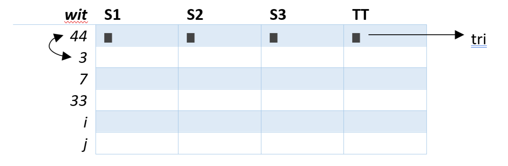

# Notes
## Projet :
Nécessité d’un affichage régulier (pas besoin d’éléments graphiques ou de temps réel mais très régulier) et lisible pour un être humain.

*PAS PLUS DE 2 SEMAINES POUR LA GENERATION DE TEMPS !*
*Pas de pénalisation énorme pour le temps.*

### Les essais :
- On tourne aux alentours des 40 secondes par secteur.
- Les voitures vont n’importe quand au stand.
- Le classement final à la fin de chaque séance -> classement sur le temps.

### Les qualifications :
- On aura des fork.

### Les courses :
- On doit pouvoir gérer les dépassements, le tri sera donc différent.

On a 1 semestre pour faire ce projet.

A défendre en Janvier en incluant un rapport (introduction, présentation du sujet, analyse du travail, exemplaire du code, difficultés rencontrées, solutions, évolutions futures, conclusion).

Groupe de 4 personnes (groupe 7) : **Maxime De Cock, Hubert Van De Walle, Dominik Fiedorczuk, Melvin Campos Casares**.

### Type d'affichage souhaité :

Dans l'histoire, la prof voit qu'on aurait 20 processus voitures et un processus d'affichage.

**1 S -> +/- 40s**
**1 PIT -> +/- 20-25s**
**Abandon -> +/- 5 voitures sur les 20**
**Course -> 40 à 70 tours**

### Code d'affichage pour le tableau :

|    Code     |    S    |       P       |   OUT   |
|-------------|---------|---------------|---------|
| Description | Secteur | Stand (= PIT) | Abandon |

#### Exemple :

Afficher en Temps tour si P (P se trouve en S3) ou OUT (si abandon ou crash).
Dans le cas de OUT, la voiture est dernière du classement.

##### Essai libre :
###### Tri temps meilleur tour

| Numéro de la voiture | S1 | S2 | S3 | Temps meilleur tour |
|----------------------|----|----|----|---------------------|
| 2                    | 35 | 39 | 38 | 1min 52s            |
| 55                   | 40 | 36 | 39 | 1min 55s            |
| 14                   | 39 | 40 | 37 | 1min 56s            |
| 28                   | 37 | 40 | 39 | 1min 56s            |

##### Qualification :
###### Tri temps meilleur tour

| Numéro de la voiture | S1 | S2 | S3 | Temps tour | Temps meilleur tour |
|----------------------|----|----|----|------------|---------------------|
| 14                   | 39 | 40 | 37 | 1min 56s   | 1min 32s            |
| 2                    | 35 | 39 | 38 | 1min 52s   | 1min 47s            |
| 55                   | 40 | 36 | 39 | 1min 55s   | 1min 55s            |
| 28                   | 39 | 40 | 37 | 1min 56s   | 1min 39s            |

##### Course :
###### Tri position dans la course

| Numéro de la voiture | S1 | S2 | S3 | Temps tour | Lap |
|----------------------|----|----|----|------------|-----|
| 2                    | 35 | 39 | 38 | 1min 52s   | 14  |
| 55                   | 40 | 36 | 39 | 1min 55s   | 14  |
| 14                   | 39 | 40 | 37 | 1min 56s   | 14  |
| 28                   | 39 | 40 | 37 | 1min 56s   | 14  |
