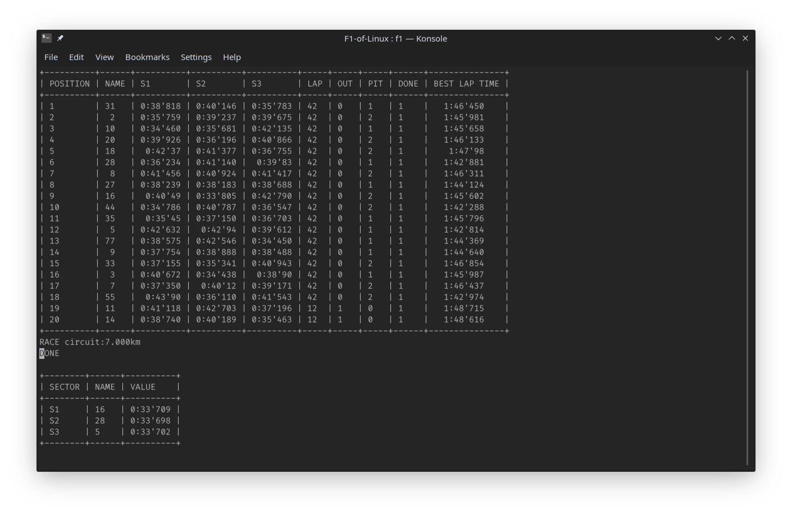

# F1-of-Linux

Projet visant à simuler un weekend de Courses Formule 1 dans le cadre de la programmation système en C

## Langage de programmation et licence

C

> GNU General Public License v3.0

## Groupe

:point_right: Numéro : 7

:point_right: Membres :

1. Melvin Campos Casares (_**@melvinmajor**_),
2. Maxime De Cock (_**@maxicosi**_),
3. Dominik Fiedorczuk (_**@domad007**_),
4. Hubert Van De Walle (_**@HE201496**_).

## Comment compiler ce projet

`make`

## Comment utiliser ce projet

`./f1` suivi de l'argument _obligatoire_  `--step` pour définir l'étape que vous souhaitez réaliser :

- P1/P2/P3 : pour les essais libres,
- Q1/Q2/Q3 : pour les qualifications (ils sont nécessaire pour l'étape suivante),
- RACE : pour la course.

L'argument _facultatif_ `--length` suivi d'un chiffre peut être utilisé pour définir une longueur spécifique, en kilomètres, d'un tour de piste.
Par défaut, elle est reglée à 7 kilomètres.

## Tâches à faire

- [x] Création du GitHub
- [x] Création d'un randomizer pour générer un temps
- [x] Création d'un affichage temporaire pour tester des parties du code
- [x] Réutilisation du randomizer pour la gestion des secteurs, tours et des crashs
- [x] Création de l'affichage final
- [x] Triage de l'affichage
- [x] Création des forks et attribuer à chaque véhicule une structure par défaut
- [x] Gestion de la compétition en 3 parties au niveau des séances d'essais libres
- [x] Gestion de la compétition en 3 parties au niveau des qualifications
- [x] Gestion de la compétition lors de la course, du grand prix

## Cahier des charges du projet

### Projet Système TP Janvier 2019

Le but du projet est de gérer un week-end complet d’un grand prix de Formule 1, depuis les séances d’essais du vendredi jusqu’à la course du dimanche, en passant par les essais du samedi et la séance de qualifications.

Il y a 20 voitures engagées dans un grand prix.
Leurs numéros sont : 44, 77, 5, 7, 3, 33, 11, 31, 18, 35, 27, 55, 10, 28, 8, 20, 2, 14, 9, 16.

Un circuit de F1 est divisé en 3 secteurs (S1, S2, S3).

Le calendrier d’un week-end de F1 est établi comme suit :

- Vendredi matin, une séance d’essais libres d’1h30 (P1)
- Vendredi après-midi, une séance d’essais libres d’1h30 (P2)
- Samedi matin, une séance d’essais libres d’1h (P3)
- Samedi après-midi, la séance de qualifications, divisée en 3 parties :
  - Q1, durée 18 minutes, qui élimine les 5 dernières voitures (qui occuperont les places 16 à 20 sur la grille de départ de la course)
  - Q2, durée 15 minutes, qui élimine les 6 voitures suivantes (qui occuperont les places 11 à 16 sur la grille de départ de la course)
  - Q3, durée 12 minutes, qui permet de classer les 10 voitures restantes pour établir les 10 premières places sur la grille de départ de la course
- Dimanche après-midi, la course en elle-même.

Votre projet devra prendre en charge les choses suivantes.

#### Première partie : gestion des séances d’essai, des qualifications et de la course

##### Lors des séances d’essais (P1, P2, P3) :

- [x] Relever les temps dans les 3 secteurs à chaque passage pour chaque voiture
- [x] Toujours savoir qui a le meilleur temps dans chacun des secteurs
- [x] Classer les voitures en fonction de leur tour complet le plus rapide
- [x] Savoir si une voiture est aux stands (P)
- [x] Savoir si une voiture est out (abandon de la séance)
- [x] Dans ces 2 derniers cas, on conserve toujours le meilleur temps de la voiture et celle-ci reste dans le classement
- [x] Conserver le classement final à la fin de la séance

##### Lors des qualifications (Q1, Q2, Q3) :

- [x] Relever les temps dans les 3 secteurs à chaque passage pour chaque voiture
- [x] Toujours savoir qui a le meilleur temps dans chacun des secteurs
- [x] Classer les voitures en fonction de leur tour complet le plus rapide
- [x] Savoir si une voiture est aux stands (P)
- [x] Savoir si une voitures est out (abandon de la séance)
- [x] Dans ces 2 derniers cas, on conserve toujours le meilleur temps de la voiture et celle-ci reste dans le classement
- [x] A la fin de Q1, il reste 15 voitures qualifiées pour Q2 et les 5 dernières sont placées à la fin de la grille de départ (places 16 à 20)
- [x] A la fin de Q2, il reste 10 voitures qualifiées pour Q3 et les 5 dernières sont placées dans les places 11 à 15 de la grille de départ
- [x] Le classement de Q3 attribue les places 1 à 10 de la grille de départ
- [x] Conserver le classement final à la fin des 3 séances (ce sera l’ordre de départ pour la course)

##### Lors de la course :

- [x] Le premier classement est l’ordre sur la grille de départ
- [x] Le classement doit toujours être maintenu tout au long de la course (gérer les dépassements)
- [x] Relever les temps dans les 3 secteurs à chaque passage pour chaque voiture
- [x] Toujours savoir qui a le meilleur temps dans chacun des secteurs
- [x] Toujours savoir qui a le tour le plus rapide
- [x] Savoir si la voiture est out (abandon) ; dans ce cas, elle sera classée en fin de classement
- [x] Savoir si la voiture est aux stands (PIT), gérer le temps aux stands et faire ressortir la voiture à sa place dans la course (généralement 2 ou 3 PIT par voitures)
- [x] Conserver le classement final et le tour le plus rapide

**_Remarque :_ les stands se trouvent toujours dans le secteur 3.**

De plus, il vous est demandé de paramétrer votre programme.

En effet, les circuits peuvent être de longueur très variable et, dès lors le nombre de tours pour la course varie également (on essaie que le nombre total de kilomètres soit toujours plus ou moins le même pour chacune des courses du calendrier).

##### On vous demande de :

- [x] Réaliser le programme en C sous Linux
- [x] Utiliser la mémoire partagée comme moyen de communication inter-processus
- [x] Utiliser les sémaphores pour synchroniser l’accès à la mémoire partagée

Bon courage.
