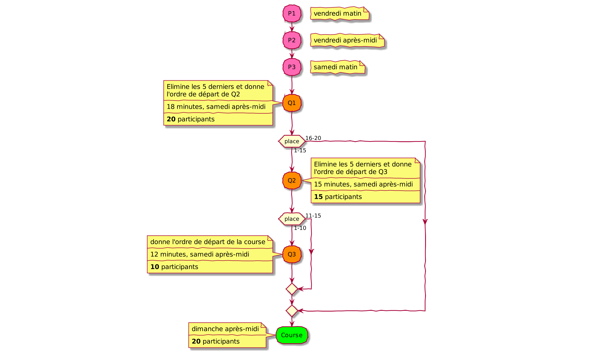

\pagebreak

Rapport du projet : F1-of-Linux
===============================

**Groupe 7**

Notre groupe est constitué de 4 personnes :

- Melvin Campos Casares
- Maxime De Cock
- Dominik Fiedorczuk
- Hubert Van De Walle

Introduction et présentation du projet
--------------------------------------

Ce projet consiste à présenter un week-end complet d'un grand prix de Formule 1, depuis les séances d'essais du vendredi jusqu'à la course du dimanche, en passant par les essais du samedi et la séance de qualifications.

Notre but consiste à reproduire cela dans un langage de programmation performant à l'exécution des méthodes implémentées, le langage C.
Nous devons générer un affichage qui gèrera les séances d'essais libres, les qualifications ainsi que la course.
De plus, certaines informations doivent être disponible : temps au tour, temps secteur, disqualification, arrêt aux stands, temps depuis le début de la course.

De plus, nous devons appliquer des concepts vus en cours en première année ainsi qu'en deuxième : processus père-fils (dont `fork` est la création d'un nouveau processus utilisateur), sémaphores (pour gérer la synchronisation des processus) et la mémoire partagée (allocation et utilisation par appel des mémoires partagées via leurs identificateurs).

\pagebreak

Cahier des charges
------------------

Nous voulons organiser un grand prix contenant 20 voitures, à la manière de la Formule 1.
Leurs numéros sont : 44, 77, 5, 7, 3, 33, 11, 31, 18, 35, 27, 55, 10, 28, 8, 20, 2, 14, 9, 16.

Un circuit de F1 est divisé en 3 secteurs (S1, S2, S3).

Le calendrier d’un week-end de Formule 1 est établi de la manière suivante :

- Vendredi matin, une séance d’essais libres d'une durée de 1h30 (P1)
- Vendredi après-midi, une deuxième séance d’essais libres d'une durée de 1h30 (P2)
- Samedi matin, une troisième et dernière séance d’essais libres d'une durée de 1h (P3)
- Samedi après-midi, une séance de qualifications est organisée et divisée en 3 parties :
  - Q1, d'une durée 18 minutes et visant à éliminer les 5 dernières voitures qui occuperont les places 16 à 20 sur la grille de départ de la course en fonction de leur meilleur temps au tour,
  - Q2, d'une durée 15 minutes, qui éliminera les 5 dernières voitures suivantes et qui occuperont les places 11 à 16 sur la grille de départ de la course en fonction de leur meilleur temps au tour,
  - Q3, d'une durée 12 minutes et permettant de classer les 10 voitures restantes pour établir les 10 premières places sur la grille de départ de la course en fonction de leur meilleur temps au tour.
- Dimanche après-midi, la course en elle-même visant à obtenir un podium ainsi qu'un classement général typique des courses de voitures.

Ce projet devra prendre en charge plusieurs particularités qui seront développées dans les points ci-dessous.

### Première partie : gestion des séances d’essai, qualifications et course

#### Lors des séances d’essais (P1, P2, P3) :

Il est nécessaire de relever les temps dans les différents secteurs (au nombre de 3) à chaque passage de chacune des voitures.

De plus, dans l'affichage des séances d'essais, il est important de connaître le meilleur temps à chaque secteur ainsi que d'autres informations pertinentes comme si la voiture est au stand (PIT) ou si elle abandonne la séance (OUT).
Malgré que les voitures soient au stand où ait abandonné la séance, on conserve toujours le meilleur temps de la voiture ainsi que son classement.

Pendant la séance d'essais, le classement des voitures se fait en fonction de leur tour complet le plus rapide.
À la fin des séances d'essais, on conserve le classement final.

#### Lors des qualifications (Q1, Q2, Q3) :

Lors des qualifications,le temps des 3 secteurs à chaque passage pour chaque voiture est à relever.

De plus, dans l'affichage des qualifications, il est important de connaître le meilleur temps à chaque secteur ainsi que d'autres informations pertinentes comme si la voiture est au stand (PIT) ou si elle abandonne la séance (OUT).
Malgré que les voitures soient au stand où ait abandonné la séance, on conserve toujours le meilleur temps de la voiture ainsi que son classement.

Le classement des voitures se fait en fonction de leur tour complet le plus rapide.

La particularité avec les qualifications est un temps réduit et l'importance de conserver le classement de chacune des séances afin d'en définir l'ordre de départ de la course.

- À la fin de la première qualification, 15 voitures resteront qualifiées pour la 2ème séance et les 5 dernières sont placées à la fin de la grille de départ (places 16 à 20),
- À la fin de la deuxième qualification, il reste 10 voitures qualifiées pour la 3ème séance et les 5 dernières sont placées dans les places 11 à 15 de la grille de départ,
- Le classement de la troisième qualification attribue les places 1 à 10 de la grille de départ.

#### Lors de la course :

L'affichage de la course présente le classement de l'ordre sur la grille de départ.
Le classement doit toujours être maintenu durant la course, même s'il y a des dépassements.
Il est important de savoir qui a le meilleur temps dans chacun des secteurs et également qui a le tour le plus rapide.

Comme pour les essais libres et les qualifications, il est nécessaire de relever les temps dans les différents secteurs à chaque passage de chacune des voitures.

- Si une voiture est en abandon de course (out), elle sera classée en fin de classement.
- Si la voiture est aux stands (PIT), le temps au stand est comptabilisé dans son temps et elle ressort à sa place dans la course.
Par ailleurs, pour ce point, il y a généralement 2 ou 3 PIT par voiture par course.

À la fin de la course, on conserve le classement final et le tour le plus rapide.

**_Remarque :_ les stands se trouvent toujours dans le secteur 3.**

De plus, il est demandé de paramétrer le programme.
En effet, les circuits peuvent être de longueur variable et le nombre de tours pour la course varie également (on essaie que le nombre total de kilomètres soit toujours plus ou moins le même pour chacune des courses du calendrier).

#### On vous demande de :

- Réaliser le programme en C sous Linux;
- Utiliser la mémoire partagée comme moyen de communication interprocessus;
- Utiliser les sémaphores pour synchroniser l’accès à la mémoire partagée.

\pagebreak

Analyse du travail
------------------

Afin de reprendre au mieux ce projet, nous avons retenu les analyses faites avec la professeur suite au premier rendez-vous du 2 avril.
Suite à ce meeting, nous avons décidé de commencer par décortiquer les demandes et en faire un tableau ainsi qu'un flowchart afin de mieux visualiser le projet :



\pagebreak

Explication des particularités du code
--------------------------------------

### Fonctionnalités du code

Le programme prend en tant qu'arguments le nom d'une étape du week-end de Formule 1 ainsi que la longueur d'un tour en kilomètres.
Si ce dernier n'est pas fourni, une valeur par défaut est attribuée.

On lance la phase sélectionnée pour chacune des voitures participantes.
Lors de la simulation, les voitures participantes vont générer des temps aléatoires à chaque secteur.

Un tableau de valeurs reprenant des informations diverses est ensuite affiché afin de pouvoir suivre l'évolution de l'étape choisie.
Les informations représentée dans ce dernier dépendent de l'étape concernée.
Ce tableau est également trié en fonction du meilleur temps de tour par pilote ou, dans le cadre de la course, trié en fonction de leur position.

Au départ de la course, chaque participant démarre dans l'ordre précédemment déterminé par les séances de qualifications et avec une pénalité relative à leur position de départ.

Lorsque la simulation d'une étape est terminée, les positions des pilotes est sauvegardée dans un fichier.
Ce fichier sera chargé lors de l'étape suivante afin de déterminer les participants ainsi que leurs positions.

### Mémoire partagée et communication entre processus

On crée une zone de mémoire partagée puis on y attache un tableau de structure.

```c
SharedStruct *data;

int struct_shm_id =
    shmget(IPC_PRIVATE, sizeof(SharedStruct) *
    options.participant_count, 0600 | IPC_CREAT);

data = shmat(struct_shm_id, NULL, 0);
```

La mémoire partagée contient un tableau de structure comportant les informations de secteurs entre autres choses.

```c
typedef struct SharedStruct {
    int id;
    int s1;
    int s2;
    int s3;
    int best_s1;
    int best_s2;
    int best_s3;
    int best_lap_time;
    int lap;
    int sector;
    int out;
    int pit;
    int done;
} SharedStruct;
```

Dans notre cas, la mémoire partagée n'est accédée ou modifiée qu'avec un seul "écrivain" et un seul "lecteur" à la fois; il n'y aura jamais plus d'une écriture et lecture en même temps.
Ici, chaque processus fils est un écrivain alors que le lecteur est le processus père.

La sémaphore nous permettent de garantir l'accès exclusif à la mémoire partagée.
Les opérations `sem_wait(sem_t *sem)` et `sem_post(sem_t *sem)` permettent respectivement de verrouiller et déverrouiller une sémaphore.

### Libération des ressources de l'ordinateur

Afin de libérer les ressources de l'ordinateur, plusieurs étapes sont réalisées une fois que les processus enfants ont terminé leur fonction et que le programme est prêt à quitter.

Premièrement, il y a "destruction" de la sémaphore par le biais de l'opération `sem_destroy(sem_t *sem)`.

Ensuite, on se détache des zones de mémoire partage et ensuite on les supprime.

```c
shmdt(data);
shmctl(struct_shm_id, IPC_RMID, NULL);

sem_destroy(sem);
shmdt(sem);
shmctl(sem_shm_id, IPC_RMID, NULL);
```

<!-- Pour ce faire, nous commençons par les détachements puis ensuite la suppression des id dans la mémoire partagée.
Ensuite, on "détruit" le segment de mémoire partagée allouée tout comme les structures de données associées avec.
Pour ce faire, nous utilisons l'opération `int shmdt(const void *shmaddr)` pour séparer la mémoire partagée puis `int shmctl(int shmid, IPC_RMID, NULL)` pour supprimer l'ID et détruire le segment de mémoire partagée. -->

### Création et gestion des processus

Chaque voiture correspond à un processus fils, tandis que le père s'occupe de la gestion des étapes et de l'affichage.

La création des processus se fait par le biais de la fonction `fork`, faisant partie des appels système POSIX.
Elle permet de donner naissance à un nouveau processus qui est sa copie.

Nos `fork` sont présent dans le fichier de code source `main.c`.

### Rôle du processus père

Dans notre cas, nous avons un processus père donnant naissance au nombre de processus fils nécessaire à l'étape choisie.
Chaque processus fils représente une voiture.

Le processus père, quant à lui, va lire des informations provenant de la mémoire partagée.
Il s'occupe également de l'affichage ainsi que du tri tout comme la sauvegarde des informations sur fichier.

\pagebreak

Difficultés rencontrées et solutions
------------------------------------

Concernant les difficultés rencontrées, suite à la reprise de ce projet pour la seconde session, il n'y a pas eu particulièrement de nouveaux problèmes rencontrés.

Comme indiqué dans le point traitant la compréhension du cahier des charges, grâce à la communication avec la professeur ainsi que du travail réalisé par chacun des membres pour la prise de note, la création d'un flowchart et d'un tableau détaillé reprenant les informations importantes de façon claire et concise, nous avons su éviter la plupart des difficultés possiblement rencontrées.

### Compréhension du cahier des charges

Au vu du cahier des charges reçu, nous avons eu des difficultés à comprendre plus concrètement comment mettre en œuvre certaines implémentations demandées tant lors de la première session que lors de la seconde session.
À force de recherche et également de questions posées dans le cadre du temps consacré spécifiquement au projet en cours lors de la première session, nous avons accumulé différentes notes nous permettant de mieux visualiser ce qui nous avait posé problème.

Deux rendez-vous ont été convenu avec la professeur (2 avril 2019 à 15h et 25 juin 2019 à 11h) afin de mieux visualiser les demandes, de comprendre ce qui n'avait pas été lors de la première session et également les détails qui n'avaient pas été correctement compris ou nous paraissant tout simplement trop flou.

Suite à ces rendez-vous avec la professeur, le flowchart et le tableau détaillé contenant les informations importantes des demandes dans le cahier des charges fourni, cette difficultée à été résolue.

\pagebreak

Évolutions futures
------------------

### Intégration de codes couleurs dans l'affichage

Il s'agit certes d'une implémentation de moindre importance, mais cela pourrait s'avérer pratique pour ressortir de manière plus rapide les informations les plus importantes.
Par exemple, on pourrait réaliser un code couleur pour :

- Les 3 premières places dans le classement,
- Le temps le plus rapide au tour,
- La voiture ayant le temps le plus rapide au tour depuis le début de la course,
- La ou les voiture(s) ayant abandonné la course (OUT).

### Affichage cliquable

Comme à la manière de `htop` dans Linux, la possibilité de cliquer sur un des en-têtes de colonne afin de trier automatiquement l'affichage en fonction de cette colonne pourrait s'avérer intéressante.
En effet, si l'utilisateur souhaite prêter plus particulièrement son attention sur une catégorie d'information précise, cela pourrait lui être utile.

### Options lié à la pression d'une touche de clavier

Une autre idée d'implémentation est de proposer des options en fonction d'un bouton appuyé lorsque le programme est en cours de fonctionnement.

Imaginons par exemple les options suivantes :

- <kbd>F1</kbd> : Help
- <kbd>F2</kbd> : Mettre en pause / Reprendre
- <kbd>F3</kbd> : Afficher / Retirer les codes couleurs
- <kbd>F4</kbd> : Tri en fonction du meilleur temps au tour
- <kbd>F5</kbd> : Tri en fonction du meilleur temps au tour total
- <kbd>F10</kbd> : Quitter

### Phase d'essai entièrement libre

Par souci de facilité (et pour se concentrer sur d'autres parties nécessitant plus de temps et de travail), nous avons décidé que les voitures présentes lors d'une séance d'essai libre démarrent toutes comme s'il s'agissent d'une étape classique (une qualification ou une course).

Il serait possible, sans nécessairement y consacrer un temps considérable, de permettre aux différents pilotes de commencer et arrêter leurs séances d'essais libres lorsqu'ils le souhaitent voire même s'ils rouleront lors de la séance.
La question concrète serait : _Est-ce que lors de la limite du temps imparti d'une séance d'essais libres, un pilote souhaite prendre le volant ou non et si oui, pour combien de tours ou combien de temps?_

Cela correspondrait bien plus à une course de Formule 1 en condition réelle.

\pagebreak

Conclusion
----------

L'avantage de ce projet est l'application de concepts multiples vue en cours théorique au courant du premier quadrimestre.
Cela nous a permis de comprendre plus concrètement ce que ces concepts permettent de faire (allocation d'une zone mémoire, appel d'une zone mémoire, sémaphores, algorithmes, fork, etc.).

Lors de la première session, ce projet nous avait permis d'apprendre à programmer de façon plus assidue.
Lors de l'écriture d'une nouvelle méthode, nous testions systématiquement le projet et en cas de problème, nous prenions le temps de relire le code (et si nécessaire, nous testions différentes méthodes pour déboguer et avancer dans le projet).
Nous avions rencontré plusieurs difficultés de compréhension par rapport au cahier des charges ainsi que d'autres difficultés rencontrées, nous avions accumulé un retard par rapport au planning que nous avions fixé au départ, mais l'avions rattrapé en courant de quadrimestre.
Malheureusement, la programmation présentée ne correspondant et ne remplissant pas toutes les demandes, cela nous a entraînés dans une seconde tentative pour ce projet.

En cette seconde session, nous avons changé de méthodologie et avons porté une importance quasi capitale sur le fait de réaliser les tests de méthodes.
Nous avons appris de nos erreurs et avons eu des moments constructifs d'échange avec la professeur afin de réussir au mieux ce projet.
Nous avons également découvert l'utilité de l'utilisation de quelques librairies, ainsi que d'une documentation disponible en ligne, nous permettant de mieux comprendre certaines implémentations nécessaires.

\pagebreak
